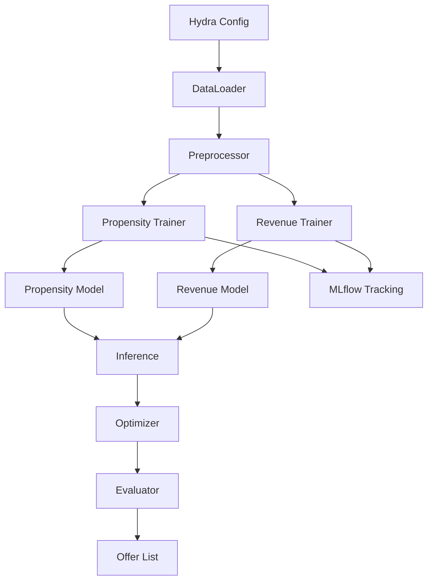

# Direct Marketing Optimization

This repository contains a case study project for optimizing direct marketing campaigns in a banking context. Dummy customer data is used to predict purchase propensity and expected revenue for three products (Consumer Loan, Credit Card, Mutual Fund). An optimization step then selects which clients to contact in order to maximize total revenue while respecting contact limitations.

## Directory Overview

```
.
├── conf/                 # Hydra configuration files
├── data/                 # Input data (raw/processed)
├── docker/               # Dockerfile for the app
├── docker-compose.yml    # Compose file to run MLflow and the app
├── docs/                 # Additional documentation
├── notebooks/            # Exploratory notebooks
├── src/                  # Source code package
├── tests/                # Unit tests
└── main.py               # Entry point for the workflow
```

## Tech Stack

The project relies on several tools and libraries to manage configuration, build
models and run the application:

- **Hydra** – organizes configuration files and allows easy experiment
  management.
- **Optuna** – performs hyperparameter search to find the best model settings.
- **MLflow** – tracks experiments and stores models for later comparison.
- **Scikit-learn** – provides machine learning algorithms used for training.
- **Streamlit** – powers the simple web interface for exploring results.
- **Docker** – containerizes the application and supporting services.
- **uv** – handles dependency management and running Python scripts.
- **Ruff** – enforces code style and static analysis checks.
- **Pytest** – runs the unit test suite.
- **Pydantic** – validates configuration and data schemas.

## Architecture Overview



## Diagram Step Descriptions

The flowchart outlines the key components of the marketing pipeline. Each node plays a specific role:

1. **Hydra Config** – manages paths, parameters and overall configuration.
2. **DataLoader** – reads raw files and converts them into data frames.
3. **Preprocessor** – cleans, merges and engineers features for modeling.
4. **Propensity Trainer** – fits a model predicting purchase likelihood.
5. **Revenue Trainer** – fits a model estimating expected revenue.
6. **Propensity Model** – saved model used to score new customers.
7. **Revenue Model** – saved model used to forecast revenue for each offer.
8. **Inference** – generates propensity scores and revenue predictions.
9. **Optimizer** – selects the best customer-product pairs under contact limits.
10. **Evaluator** – computes metrics like AUC and expected revenue.
11. **Offer List** – final list of recommended offers per customer.
12. **MLflow Tracking** – records experiments, metrics and artifacts.


## Configuration

Hydra configuration files live under `conf/`. The main file `conf/config.yaml` controls data paths, preprocessing settings, model training options and optimization parameters. Key fields include:

- `data.raw_excel_path` – location of the Excel dataset.
- `products` – list of products to model (`CL`, `MF`, `CC`).
- `optimization.contact_limit` – maximum number of clients to contact.
- `mlflow` – settings for experiment tracking.

Model-specific parameters are defined in `conf/propensity_model/` and `conf/revenue_model/`. Adjust these YAML files to change hyperparameters or the underlying algorithm.

## Running the Project

1. **Install dependencies**
   ```bash
   uv sync
   ```
2. **Run tests**
   ```bash
   PYTHONPATH=. pytest
   ```
3. **Execute the workflow**
   ```bash
   uv run main.py
   ```

### Using Docker Compose

To start an MLflow server and run the application in containers, execute:

```bash
sudo docker compose -f docker-compose.yml up
```

This will build the application image and launch two services: `mlflow` for experiment tracking and `direct-marketing` which runs `uv run main.py`.

## Purpose

The goal is to maximize marketing revenue by:
1. Building propensity models for each product.
2. Estimating expected revenue from purchases.
3. Optimizing the targeting strategy so that each client receives at most one offer and the total number of contacts does not exceed the specified limit.

This setup mirrors a real-world scenario where a bank must allocate limited marketing resources to the most promising customers.


