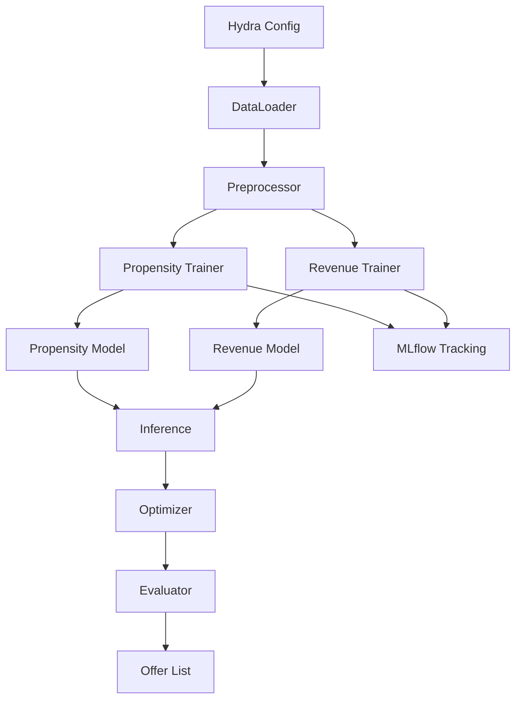

# Direct Marketing Optimization

This repository contains a case study project for optimizing direct marketing campaigns in a banking context. Dummy customer data is used to predict purchase propensity and expected revenue for three products (Consumer Loan, Credit Card, Mutual Fund). An optimization step then selects which clients to contact in order to maximize total revenue while respecting contact limitations.

## Directory Overview

```
.
├── conf/                 # Hydra configuration files
├── data/                 # Input data (raw/processed)
├── docker/               # Dockerfile for the app
├── docker-compose.yml    # Compose file to run MLflow and the app
├── docs/                 # Additional documentation
├── notebooks/            # Exploratory notebooks
├── src/                  # Source code package
├── tests/                # Unit tests
└── main.py               # Entry point for the workflow
```

## Architecture Overview



## Configuration

Hydra configuration files live under `conf/`. The main file `conf/config.yaml` controls data paths, preprocessing settings, model training options and optimization parameters. Key fields include:

- `data.raw_excel_path` – location of the Excel dataset.
- `products` – list of products to model (`CL`, `MF`, `CC`).
- `optimization.contact_limit` – maximum number of clients to contact.
- `mlflow` – settings for experiment tracking.

Model-specific parameters are defined in `conf/propensity_model/` and `conf/revenue_model/`. Adjust these YAML files to change hyperparameters or the underlying algorithm.

## Running the Project

1. **Install dependencies**
   ```bash
   uv sync
   ```
2. **Run tests**
   ```bash
   PYTHONPATH=. pytest
   ```
3. **Execute the workflow**
   ```bash
   uv run main.py
   ```

### Using Docker Compose

To start an MLflow server and run the application in containers, execute:

```bash
sudo docker compose -f docker-compose.yml up
```

This will build the application image and launch two services: `mlflow` for experiment tracking and `direct-marketing` which runs `uv run main.py`.

## Purpose

The goal is to maximize marketing revenue by:
1. Building propensity models for each product.
2. Estimating expected revenue from purchases.
3. Optimizing the targeting strategy so that each client receives at most one offer and the total number of contacts does not exceed the specified limit.

This setup mirrors a real-world scenario where a bank must allocate limited marketing resources to the most promising customers.


