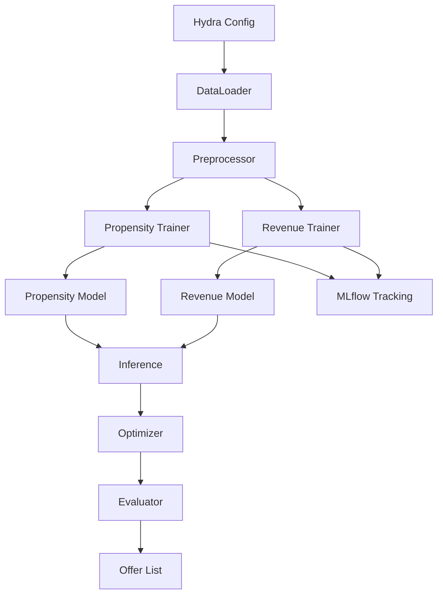

# Direct Marketing Optimization

This repository contains a case study project for optimizing direct marketing campaigns in a banking context. Dummy customer data is used to predict purchase propensity and expected revenue for three products (Consumer Loan, Credit Card, Mutual Fund). An optimization step then selects which clients to contact in order to maximize total revenue while respecting contact limitations.

## Directory Overview

```
.
├── .dockerignore         # Docker ignore file
├── .env_example          # Environment variables template
├── .gitignore            # Git ignore file
├── README.md             # Project documentation
├── artifacts/            # Generated artifacts
├── conf/                 # Hydra configuration files
│   ├── config.yaml       # Main configuration file
│   ├── logging.yaml      # Logging configuration
│   ├── propensity_model/ # Propensity model configurations
│   └── revenue_model/    # Revenue model configurations
├── data/                 # Input data (raw/processed)
├── docker/               # Docker configuration
│   └── direct-marketing.Dockerfile
├── docker-compose.yml    # Compose file to run MLflow and the app
├── docs/                 # Additional documentation
├── images/               # Documentation images
├── main.py               # Entry point for the workflow
├── mlruns/               # MLflow experiment tracking data
├── notebooks/            # Exploratory Jupyter notebooks
├── outputs/              # Generated output files
├── pages/                # Streamlit app pages
├── pyproject.toml        # Python project configuration
├── ruff.toml             # Ruff linter configuration
├── src/                  # Source code package
├── streamlit_app.py      # Main Streamlit application
├── tests/                # Unit tests
└── uv.lock               # UV dependency lock file
```

## Tech Stack

This project leverages several modern Python libraries and tools:

<div style="display: flex; justify-content: space-around; flex-wrap: wrap; align-items: center; margin-bottom: 20px;">
  
  
  
  
  
  
  
  
  
  
</div>

- **Hydra** – organizes configuration files and allows easy experiment
  management.
- **Optuna** – performs hyperparameter search to find the best model settings.
- **MLflow** – tracks experiments and stores models for later comparison.
- **Scikit-learn** – provides machine learning algorithms used for training.
- **Streamlit** – powers the simple web interface for exploring results.
- **Docker** – containerizes the application and supporting services.
- **uv** – handles dependency management and running Python scripts.
- **Ruff** – enforces code style and static analysis checks.
- **Pytest** – runs the unit test suite.
- **Pydantic** – validates configuration and data schemas.
- **Plotly** – provides visualizations.
- **CVXPY** – optimization library for mathematical programming.
- **Streamlit** – creates interactive multi-page web applications. 


## Architecture Overview



## Diagram Step Descriptions

The flowchart outlines the key components of the marketing pipeline. Each node plays a specific role:

1. **Hydra Config** – manages paths, parameters and overall configuration.
2. **DataLoader** – reads raw files and converts them into data frames.
3. **Preprocessor** – cleans, merges and engineers features for modeling.
4. **Propensity Trainer** – fits a model predicting purchase likelihood.
5. **Revenue Trainer** – fits a model estimating expected revenue.
6. **Propensity Model** – saved model used to score new customers.
7. **Revenue Model** – saved model used to forecast revenue for each offer.
8. **Inference** – generates propensity scores and revenue predictions.
9. **Optimizer** – selects the best customer-product pairs under contact limits.
10. **Evaluator** – computes metrics like AUC and expected revenue.
11. **Offer List** – final list of recommended offers per customer.
12. **MLflow Tracking** – records experiments, metrics and artifacts.


## Configuration

Hydra configuration files live under `conf/`. The main file `conf/config.yaml` controls data paths, preprocessing settings, model training options and optimization parameters. Key fields include:

- `data.raw_excel_path` – location of the Excel dataset.
- `products` – list of products to model (`CL`, `MF`, `CC`).
- `optimization.contact_limit` – maximum number of clients to contact.
- `mlflow` – settings for experiment tracking.

Model-specific parameters are defined in `conf/propensity_model/` and `conf/revenue_model/`. Adjust these YAML files to change hyperparameters or the underlying algorithm.

## Running the Project

1. **Install dependencies**
   ```bash
   uv sync
   ```
2. **Run tests**
   ```bash
   PYTHONPATH=. pytest
   ```
3. **Execute the workflow**
   ```bash
   uv run main.py
   ```
4. **Launch the Streamlit dashboard**
   ```bash
   uv run streamlit run streamlit_app.py
   ```

### Docker Compose

To start an MLflow server and run the application in containers:

```bash
sudo docker compose -f docker-compose.yml up
```

This will build the application image and launch multiple services:
- `mlflow` for experiment tracking (accessible at http://localhost:5000)
- `direct-marketing` which runs the main pipeline
- `streamlit` which exposes the dashboard on port 8501

## Streamlit Application

The project includes a comprehensive Streamlit web application with multiple pages:

- **Methodology** – explains the approach and methodology
- **Summary** – provides an overview of results
- **Filter** – allows filtering and exploration of data
- **Propensity** – shows propensity model results and predictions
- **Evaluation** – displays model evaluation metrics
- **Client List** – presents the optimized client list for marketing
- **Revenue** – shows revenue model predictions and analysis

Launch the app with:
```bash
uv run streamlit run streamlit_app.py
```

## Purpose

The goal is to maximize marketing revenue by:
1. Building propensity models for each product.
2. Estimating expected revenue from purchases.
3. Optimizing the targeting strategy so that each client receives at most one offer and the total number of contacts does not exceed the specified limit.

This setup mirrors a real-world scenario where a bank must allocate limited marketing resources to the most promising customers.

## Key Features

- **Multi-Product Modeling** – supports modeling for Credit Cards (CC), Consumer Loans (CL), and Mutual Funds (MF)
- **Dual Model Architecture** – separate models for purchase propensity and expected revenue
- **Hyperparameter Optimization** – uses Optuna for automated hyperparameter tuning
- **Experiment Tracking** – MLflow integration for model versioning and comparison
- **Interactive Dashboard** – comprehensive Streamlit web interface
- **Optimization Engine** – mathematical optimization to maximize revenue under constraints
- **Configurable Pipeline** – Hydra-based configuration management
- **Comprehensive Testing** – full test suite with pytest
- **Containerized Deployment** – Docker support for easy deployment


## Dependencies

The project uses modern Python tooling and libraries as defined in `pyproject.toml`:

**Core ML/Data Libraries:**
- `scikit-learn` – machine learning algorithms
- `pandas` & `numpy` – data manipulation and analysis
- `cvxpy` – convex optimization
- `mlflow` – experiment tracking and model management

**Configuration & Workflow:**
- `hydra-core` – configuration management
- `hydra-optuna-sweeper` – hyperparameter optimization
- `pydantic` – data validation and settings management

**Visualization & UI:**
- `streamlit` – web application framework
- `plotly` – interactive visualizations
- `matplotlib` & `seaborn` – statistical plotting

**Development & Testing:**
- `pytest` – testing framework
- `ruff` – fast Python linter and formatter
- `jupyter` – notebook environment

## Documentation

Project documentation is built with [Sphinx](https://www.sphinx-doc.org/). To
generate the HTML docs run:

```bash
cd docs
make html
```

The output will be available in `docs/build/html/index.html`.

## Author & Contact Information 👋

👤 **Author:** Christopher Hoo

📧 **Email:** c-hi.yang@hotmail.sg

💼 **LinkedIn:** [Link 🔗](https://www.linkedin.com/in/christopher-chi-yang-hoo-570698bb/)
